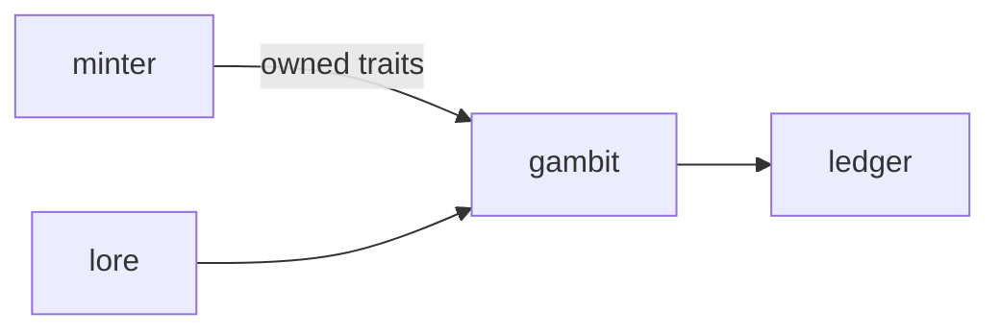

# Gambit

**Pet Card Duel** — Collectible card game where pet traits become abilities — cards mirror what you actually own.

Part of [ComputerPets](https://github.com/RicheyWorks/computerpets). Map: [computerpets-ecosystem](https://github.com/RicheyWorks/computerpets-ecosystem).

| | |
| --- | --- |
| Status | Design scaffold — loop and engine frozen |
| License | MIT |
| Tokens | Minigames never mint or burn. Tired overlay, not a dead lineage. |
| First pet | [Meet Rui first](https://github.com/RicheyWorks/computerpets/blob/main/docs/START-HERE.md). This game is optional. |

## The loop

You cannot play a dragon if you do not have one. Gambit decks are projections of owned pets + traits. Proxies in casual; ranked is ownership-checked via Minter.

## Who plays

Owners. Ranked decks are ownership-checked.

## What it is not

A dragon if you do not have one. Casual may proxy; ranked may not.

## Genre and engine

- Genre: **CCG**
- Engine: **Next.js / WebGL**
- Stack: TypeScript · Next.js · WebGL board · trait cards from owned pets · server-authoritative duels
- Default surface: `3000`

## Architecture



## How you play

1. Build a 30-card deck from owned traits.
2. Best of 3, turn clock.
3. Card art from Atelier / Studio.
4. Ranked rewards = cosmetics + treats.

## First slice

Build this and stop.

**30-card deck from owned traits, best of 1 vs dummy, server-authoritative.**

You know it works when: Sold NFT mid-queue cancels. Disconnect: timer concede. Chain cap 16.

## Environment

Node 22

## Failure doctrine

Sold NFT mid-queue → deck illegal, match cancel. Disconnect → timer concedes. Scripted combo overflow → cap chain at 16.

Canon rules that never yield:

- 210 living kinds. No illegal hybrids.
- Overlay pets can get tired, sick, or hide. Tokens are not burned by a minigame.
- Desktop walk stays the main quest. Closing Gambit must leave Rui walking.

## Neighbors

- computerpets-minter
- computerpets-lore
- computerpets-ledger
- computerpets-steamgate
- computerpets-arena

## Layout

```
computerpets-gambit/
  README.md
  LICENSE
  docs/DESIGN.md
  src/                implementation lands here
```

## Run (Windows)

```powershell
cd app; npm install; npm run dev
```

Meet Rui first via the [flagship start-here](https://github.com/RicheyWorks/computerpets/blob/main/docs/START-HERE.md). This game is optional.

## Links

- Flagship: [RicheyWorks/computerpets](https://github.com/RicheyWorks/computerpets)
- This repo: [RicheyWorks/computerpets-gambit](https://github.com/RicheyWorks/computerpets-gambit)
- Map: [RicheyWorks/computerpets-ecosystem](https://github.com/RicheyWorks/computerpets-ecosystem)
- Design file: [docs/DESIGN.md](docs/DESIGN.md)

## License

MIT. See [LICENSE](LICENSE).

---

*Two hundred ten living kinds. Keep them so a line does not go quiet.*
