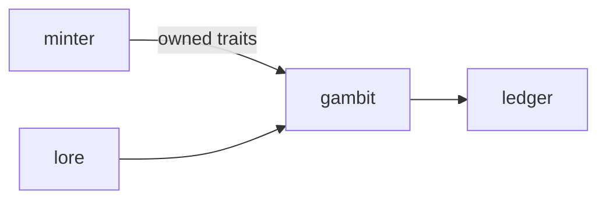

# Gambit

**Pet Card Duel** — A planned card-duel game that turns owned pet traits into a playable deck.

Part of [ComputerPets](https://github.com/RicheyWorks/computerpets). Map: [computerpets-ecosystem](https://github.com/RicheyWorks/computerpets-ecosystem).

[Status](#status) · [Design](docs/DESIGN.md) · [Contributor start](#contributor-start) · [Ecosystem](https://github.com/RicheyWorks/computerpets-ecosystem)

| Project | At a glance |
| --- | --- |
| Status | Design scaffold; not runnable yet |
| License | MIT |
| Tokens | Minigames never mint or burn. Tired overlay, not a dead lineage. |
| First pet | [Flagship start guide](https://github.com/RicheyWorks/computerpets/blob/main/docs/START-HERE.md) |

## Status

This repository contains a [design](docs/DESIGN.md) and a [source placeholder](src/index.ts). It has no runnable application, build manifest, automated tests, or CI workflow.

The experience, interfaces, integrations, and safeguards below are **implementation plans**, not supported features. The first implementation slice defines the initial contribution target.

## Planned experience

You cannot play a dragon if you do not have one. Gambit decks are projections of owned pets + traits. Proxies in casual; ranked is ownership-checked via Minter.

## Intended audience

Owners. Ranked decks are ownership-checked.

## Out of scope

A dragon if you do not have one. Casual may proxy; ranked may not.

## Planned genre and engine

- Genre: **CCG**
- Engine: **Next.js / WebGL**
- Stack: TypeScript · Next.js · WebGL board · trait cards from owned pets · server-authoritative duels
- Proposed surface: `3000`

## Proposed integration



## Proposed play loop

1. Build a 30-card deck from owned traits.
2. Best of 3, turn clock.
3. Card art from Atelier / Studio.
4. Ranked rewards = cosmetics + treats.

## First implementation slice

Initial implementation target:

**30-card deck from owned traits, best of 1 vs dummy, server-authoritative.**

Acceptance targets: Sold NFT mid-queue cancels. Disconnect: timer concede. Chain cap 16.

## Planned environment

Node 22

## Planned safeguards

Sold NFT mid-queue → deck illegal, match cancel. Disconnect → timer concedes. Scripted combo overflow → cap chain at 16.

Design constraints:

- 210 living kinds. No illegal hybrids.
- Overlay pets can get tired, sick, or hide. Tokens are not burned by a minigame.
- Desktop walk stays the main quest. Closing Gambit must leave Rui walking.

## Related projects

- [computerpets-minter](https://github.com/RicheyWorks/computerpets-minter)
- [computerpets-lore](https://github.com/RicheyWorks/computerpets-lore)
- [computerpets-ledger](https://github.com/RicheyWorks/computerpets-ledger)
- [computerpets-steamgate](https://github.com/RicheyWorks/computerpets-steamgate)
- [computerpets-arena](https://github.com/RicheyWorks/computerpets-arena)

## Layout

```
computerpets-gambit/
  README.md
  LICENSE
  docs/DESIGN.md
  src/                implementation lands here
```

## Contributor start

With Git and PowerShell, clone the scaffold and read its design and source marker:

```powershell
git clone https://github.com/RicheyWorks/computerpets-gambit.git
Set-Location computerpets-gambit
Get-Content .\docs\DESIGN.md
Get-Content .\src\index.ts
```

Start with the [first implementation slice](#first-implementation-slice). Add the minimum project setup and tests needed for that slice, then document verified run commands. The proposed stack above is a design choice; there is no install or launch command for this checkout yet.

## Links

- Flagship: [RicheyWorks/computerpets](https://github.com/RicheyWorks/computerpets)
- This repo: [RicheyWorks/computerpets-gambit](https://github.com/RicheyWorks/computerpets-gambit)
- Map: [RicheyWorks/computerpets-ecosystem](https://github.com/RicheyWorks/computerpets-ecosystem)
- Design file: [docs/DESIGN.md](docs/DESIGN.md)

## License

MIT. See [LICENSE](LICENSE).

---

*Two hundred ten living kinds. Keep them so a line does not go quiet.*
